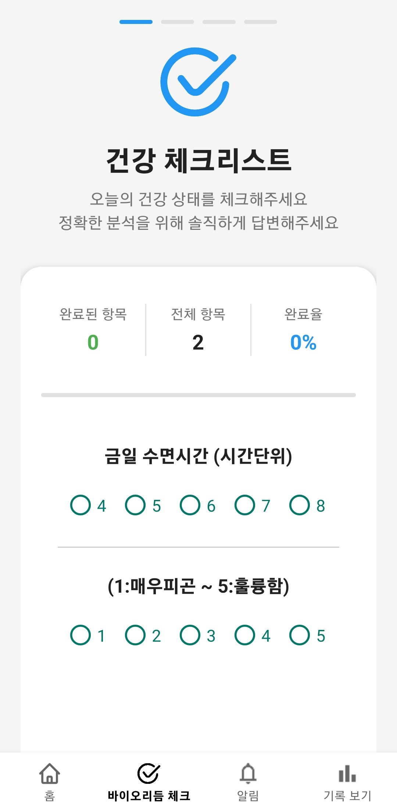
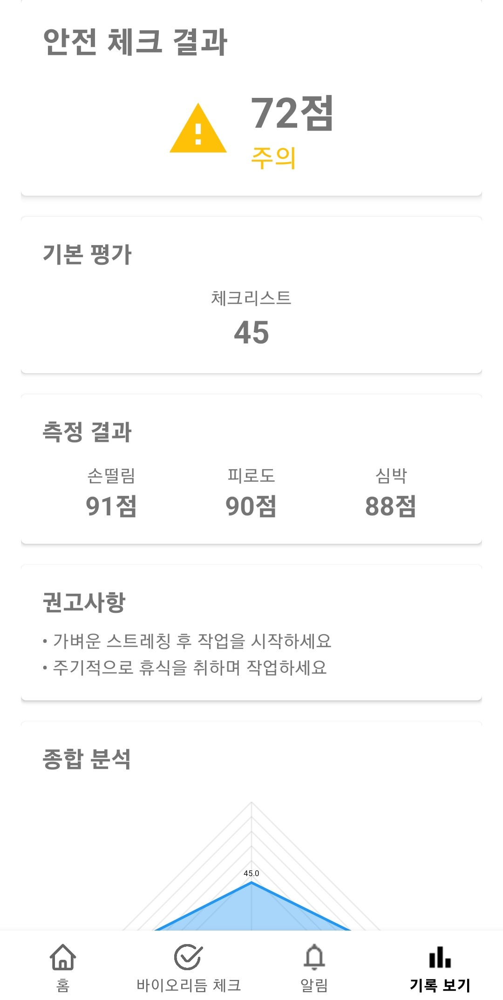
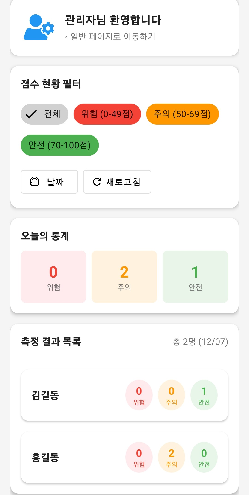

# BiMoS (Bio-signal-based Monitoring System)

##### **BiMoS**는 작업 시작 전 사용자의 생체신호와 신체 컨디션을 빠르게 점검해 안전 사고를 예방하도록 돕는 Android 앱입니다.  
##### 체크리스트, 안면 인식 눈 깜빡임, 카메라‑기반 PPG, 가속도 센서를 활용한 손떨림 분석을 통합하여 피로도·주의력 저하를 감지하고, 관리자 모드로 기록을 관리합니다.
##### 추가적으로 한파, 폭염 등 기상 이변에 대한 알림 서비스를 제공하고 별도 알림 서비스 기능이 구현되어 있습니다.

---

## 주요 기능

- **체크리스트** : 작업 전 자기보고식 안전 상태 점검 (2~5지선다) 
- **PPG 측정** : 스마트폰 카메라로 심박수·HRV 분석  
- **손떨림 분석** : 가속도 FFT 계산으로 떨림 크기·주파수 산출  
- **피로도 분석** : 안면 인식 눈 깜빡임을 통한 피로도 분석  
- **기상 정보** : 현재 사용자 위치 기준 기상 정보 제공
- **기상 특보** : 현재 사용자 위치 기준 가장 가까운 기상 관측소 발 기상 특보 제공 
- **알림 & 로그 기록** : 관리자모드를 통한 실시간 알림기능, Firebase에 데이터 저장
- **관리자 모드** : 사용자별 기록 열람·필터·삭제 기능

---

## 기술 스택

| 분류 | 사용 기술                                                                |
|------|----------------------------------------------------------------------|
| **언어** | Kotlin, TypeScript                                                   |
| **프레임워크 / UI** | AndroidX, Jetpack Compose, Material 3                                |
| **Backend-as-a-Service** | Firebase (Functions, Firestore, Storage) |
| **센서 / 비전** | CameraX, ML Kit Face Detection                                       |
| **차트 & 연산** | MPAndroidChart, JTransforms (FFT)                                    |
| **DI / 비동기** | Hilt, Kotlin Coroutines, WorkManager                                 |
| **테스트** | JUnit, AndroidX Test, Espresso                                       |

---

## 프로젝트 구조

```bash
app/
└── src/main/
    ├── java/com.jjangdol.biorhythm/
    │   ├── data/          # Repository, Firebase 연동
    │   ├── di/            # Hilt 모듈
    │   ├── model/         # 데이터 클래스
    │   ├── ui/
    │   │   ├── checklist/
    │   │   ├── weather/   # 홈 메뉴 (날씨, 작업시간, 기상 특보 등), 로그인 시 메인화면
    │   │   ├── measurement/   # PPG·떨림·피로도 측정 화면
    │   │   ├── result/
    │   │   ├── admin/
    │   │   └── ...
    │   ├── util/          # 공통 유틸
    │   ├── vm/            # ViewModel
    │   ├── BioApp.kt
    │   └── MainActivity.kt
    ├── res/               # 레이아웃·이미지·values·기상관측소 정보 등
    └── AndroidManifest.xml
```

---

## 설치 & 실행

1. 저장소를 클론합니다.
   ```bash
   git clone https://github.com/HyunsolChoi/capstone-bio-app.git
   cd biorhythm-app
   ```

2. Firebase 프로젝트를 생성하고 **google-services.json** 파일을 `app/` 디렉터리에 넣습니다.  
   (Functions·Firestore·Storage를 활성화 후 보안 규칙을 설정합니다)

3. Firebase 함수를 빌드하고 배포합니다.
   ```bash 
   cd ./functions
   npm run build
   firebase deploy functions
   ```
   
4. Google Cloud Console -> Secret Manager API 비밀키를 업로드합니다.
   현재 프로젝트는 두개의 키를 사용하며 각각 WEATHER_ALERT_KEY(공공데이터포털), WEATHER_SERVICE_KEY(API hub)입니다.

5. Android Studio에서 프로젝트를 열고 **Run ▶️** 버튼을 눌러 기기 또는 에뮬레이터에 배포합니다.

---

## 앱 미리보기

| 메인 화면 | 분석 결과 | 관리자 화면 |             
|-------|-------|--------|
|  |  |  |

---

## 1차 개발팀

| 이름 | 역할 |
|------|------|
| 김선강 | 프론트엔드 · 측정 알고리즘 |
| 장효빈 | Firebase 연동 · 관리자 기능 |
| 최영민 | UI/UX 설계 · QA |
| 전재영 | 체크리스트 시스템 · 알림 로직 |

---

## 2차 개발팀

| 이름  | 역할         |
|-----|------------|
| 최현솔 | 백엔드 인프라, 백엔드 로직 관리 |
| 최재원 | UI/UX설계 및 프론트 개발 |
| 김부강 | DB설계 및 관리  |

---

## API 참고사항

- https://apihub.kma.go.kr/ 동네 예보 조회 - 초단기예보 조회
   사용자 지역 기상 정보 조회용
   지역별로 저장하며 갱신 시 기존 데이터 덮어쓰기 

- https://www.data.go.kr/iim/api/selectAPIAcountView.do 기상청_기상특보 조회서비스 - 기상특보목록조회
   사용자 지역 기상 특보 목록 조회용
   해제 시까지 Firestore에 유지하도록 구현
   app/src/main/res/raw/stn_id_info.json 을 통해 기상관측소들의 위치를 별도로 저장

* 공공데이터포털로 일관되게 할 수 있었으나, 2025년 9월 26일 국가정보자원관리원 화재로 인해 서버가 다운되어 복구된 서비스에 한해 개발하느라 제한이 있었습니다.

---

## 데이터베이스 일괄 업로드 방법

* Node.js가 사용자의 PC에 설치되있어야 합니다.

- Firebase 컬렉션에 인사정보 csv 파일을 일괄적으로 업로드 가능합니다.
    1. c드라이브에 업로드용 폴더를 생성합니다. ex) csv_upload

    2. 해당 폴더에 csv 파일, upload.js, serviceAccountKey.json을 넣습니다.
       2.1. serviceAccountKey.json 파일은 Firebase -> 프로젝트 설정 -> 서비스 계정 -> 새 비공개 키 생성 버튼을 누르면 다운로드 됩니다.
       2.2. [upload.js 다운로드 받기](./upload.js)

    3. 안드로이드 스튜디오 터미널 -> cd 이용해서 해당 폴더로 경로를 설정합니다.
   ```bash
   cd csv_upload
   ```

    4. npm init -y로 package.json 파일 생성, 업로드 폴더에 생성됐는지 확인합니다.
   ```bash
   npm init -y
   ```

    5. npm install firebase-admin csv-parser를 입력합니다.
   ```bash
   npm install firebase-admin csv-parser
   ```

    6. 이후, node upload.js를 입력하면 컬렉션에 업로드 됩니다.
   ```bash
   node upload.js
   ```

## 참고

.firebaserc 의 projects.default는 Project ID로 갱신 바랍니다.

개발 간에 기존 작성된 불필요한 코드들이 많아 삭제를 많이 하였으나 일부 남아있을 수 있습니다. *by 2팀*

---
